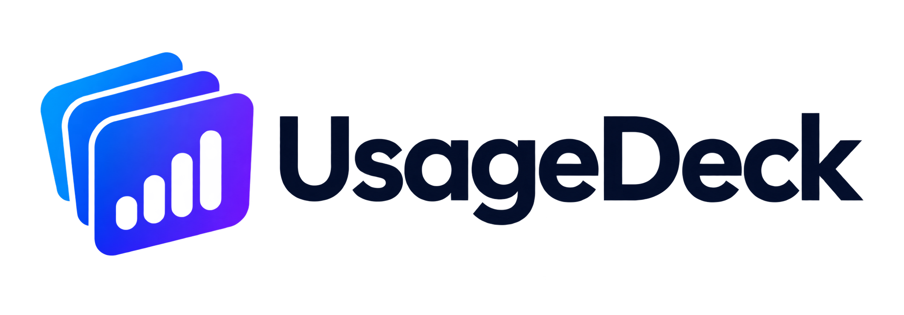

<p align="center">
  
</p>

<h1 align="center">UsageDeck</h1>

<p align="center">
  <a href="README.md">English</a> · <a href="README.zh-TW.md">繁體中文</a> · 日本語 · <a href="README.ko.md">한국어</a>
</p>

<p align="center">
  <b>契約している AI コーディングツールの残量を、ひとつのパネルに。</b>
</p>

<p align="center">
  <a href="https://github.com/lamchun1110/UsageDeck/actions/workflows/ci.yml"></a>
  <a href="https://github.com/lamchun1110/UsageDeck/releases/latest"></a>
  <a href="https://github.com/lamchun1110/UsageDeck/releases"></a>
  <a href="LICENSE"></a>
</p>

13 種類のコーディングアシスタント、13 個の課金ダッシュボード、そして「上限に達しました」の 13 通りの言い回し。UsageDeck は、すでにマシンにある認証情報をそのまま読み取り、本当に知りたい 3 つのことだけに答える小さなデスクトップアプリです。あとどれだけ残っているか、いつリセットされるか、ここまでいくら使ったか。

トレイまたはメニューバーに常駐します。アカウント登録は不要で、サインインするものもありません。

## OpenQuota からの移行

UsageDeck は OpenQuota のフォークとして始まり、現在は独立したプロジェクトです。データはそのまま引き継がれます：初回起動時、UsageDeck は既存の OpenQuota インストールから設定・使用履歴・価格キャッシュを自動で移行し、OS の資格情報ストアに保存された API キーも UsageDeck 固有のエントリーへ移します。旧ロケーションから削除されるものはありません。`~/.config/openquota/<provider>.json` に保存されたキーも引き続き読み込まれます。新しいキーは `~/.config/usagedeck/` に保存されます。

## インストール

[最新リリース](https://github.com/lamchun1110/UsageDeck/releases/latest)からお使いのプラットフォーム向けのファイルを取得してください。

| プラットフォーム | ファイル                                   | 備考                                  |
| ---------------- | ------------------------------------------ | ------------------------------------- |
| Windows          | `_x64-setup.exe` または `_arm64-setup.exe` | x64 と ARM64                          |
| macOS            | `_universal.dmg`                           | Apple Silicon と Intel、macOS 11 以降 |
| Linux            | `.AppImage` または `.deb`                  | x64 と ARM64                          |

アプリは自動で更新されます。更新ペイロードはプロジェクト独自のアップデーター鍵で署名されており、これは OS のパッケージ署名とは別の仕組みです。

> [!IMPORTANT]
> このビルドではネイティブ署名が既定で無効です。Windows インストーラーは Authenticode 署名されず、macOS アプリはアドホック署名のみで Apple の公証も受けていません。そのため SmartScreen や Gatekeeper が確認を求めることがあり、macOS では「プライバシーとセキュリティ」での手動許可が必要になる場合があります。ダウンロードは必ず本リポジトリのリリースページから行ってください。各リリースのノートに、そのリリースの正確な署名状況が記載されています。

## 取得できる情報

| プロバイダー                                      | 認証情報 | 取得内容                                                                   |
| ------------------------------------------------- | -------- | -------------------------------------------------------------------------- |
| **[Claude Code](docs/providers/claude.md)**       | ローカル | 複数アカウント、セッションと週次の上限、モデル別使用量、トークン履歴、費用 |
| **[Codex](docs/providers/codex.md)**              | ローカル | セッションと週次の上限、クレジット、トークン履歴、モデル内訳、費用         |
| **[Command Code](docs/providers/commandcode.md)** | ローカル | セッション・週次・月次の上限と追加クレジット                               |
| **[Cursor](docs/providers/cursor.md)**            | ローカル | 全体・Auto・API の使用量、クレジット、トークン履歴、費用                   |
| **[Antigravity](docs/providers/antigravity.md)**  | ローカル | Gemini と Claude で共有されるクォータ                                      |
| **[Copilot](docs/providers/copilot.md)**          | ローカル | プレミアムリクエスト、追加使用量、チャットと補完の上限、組織課金           |
| **[Devin](docs/providers/devin.md)**              | ローカル | 日次と週次の上限、リセット時刻、追加使用量の残高                           |
| **[Grok](docs/providers/grok.md)**                | ローカル | 週次の割当、追加使用量の状態、トークン履歴、費用                           |
| **[OpenCode](docs/providers/opencode.md)**        | ローカル | Go のセッション・週次・月次の上限と、ローカルの使用履歴                    |
| **[OpenRouter](docs/providers/openrouter.md)**    | API キー | クレジット残高と日次・週次・月次の費用                                     |
| **[Z.ai](docs/providers/zai.md)**                 | API キー | GLM Coding Plan のセッション・週次・ウェブ検索の上限                       |
| **[Kimi](docs/providers/kimi.md)**                | API キー | Kimi Code のセッションと週次の上限（ドメインを選択可能）                   |
| **[MiniMax](docs/providers/minimax.md)**          | API キー | Token Plan のセッションと週次の上限                                        |

**ローカル**のプロバイダーは、CLI やエディターが作成済みのログインをそのまま利用するため、設定は不要です。**API キー**のプロバイダーは「カスタマイズ」で一度キーを貼り付ける必要があります。キーは設定ファイルではなく OS の資格情報ストアに直接保存されます。Codex のサブスクリプション上限には ChatGPT のログインが必要で、API キーのみの環境では表示されません。

## 使い心地

- **トレイのポップアップ、またはフローティングウィンドウ。** さっと確認して閉じるか、サブディスプレイに開いたままにするか。
- **重要な値をピン留め。** 任意のメトリクスをトレイや macOS のメニューバーに表示できます。
- **使用量と残量。** 考えやすいほうで表示できます。
- **ペース配分。** 上限に達してしまう前に、現在のペースで次のリセットまで持つかどうかを知らせます。
- **履歴。** 今日・昨日・直近 30 日のトークン使用量と概算費用。
- **自由なレイアウト。** プロバイダーとメトリクスの並べ替え、行の非表示、セクションの折りたたみ。
- **邪魔をしない。** ログイン時に起動、グローバルショートカット、システムテーマへの追従。

すべてローカルで動作します。アカウントもバックエンドも、分析もテレメトリーもありません。

## ソースからのビルド

Node.js 22 以降、pnpm 11.11.0、安定版 Rust ツールチェーン、そしてお使いのプラットフォーム向けの [Tauri 2 の前提条件](https://v2.tauri.app/start/prerequisites/)が必要です。

```sh
corepack pnpm install --frozen-lockfile
corepack pnpm tauri dev
```

プルリクエストを送る前に、フォーマット・Lint・型・コントラクト・両方のテストを含む全チェックを実行してください。

```sh
corepack pnpm verify
```

現在のプラットフォーム向けのパッケージング:

```sh
corepack pnpm build:installer             # Windows
corepack pnpm build:linux                 # Linux
corepack pnpm tauri build --bundles dmg   # macOS
```

リリースと署名の要件は [docs/releasing.md](docs/releasing.md) にあります。

## コントリビューション

Issue と Pull Request を歓迎します。まず [CONTRIBUTING.md](CONTRIBUTING.md) をお読みください。セキュリティ上の問題は公開 Issue ではなく、[SECURITY.md](SECURITY.md) の手順に従って非公開で報告してください。

## 系譜

はじめに Robin Ebers による macOS 向けの [OpenUsage](https://github.com/robinebers/openusage) がありました。続いて deviffyy の [OpenQuota](https://github.com/deviffyy/OpenQuota) が、その発想を Tauri による Windows・Linux・macOS 対応アプリとして作り直しました。UsageDeck は同プロジェクトのフォークとして始まり、独自のアイデンティティ・リリース基盤・ロードマップを持つ独立製品へと成長しました。オリジナルのデザインと初期コードの大部分の功績は、この 2 つのプロジェクトに帰属します。ありがとうございます。

## ライセンス

[MIT](LICENSE)
