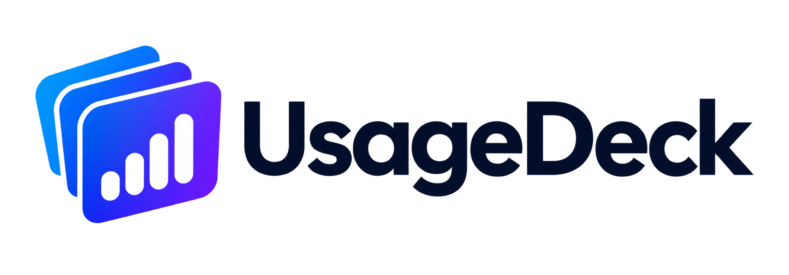

<p align="center">
  
</p>

<h1 align="center">UsageDeck</h1>

<p align="center">
  <a href="README.md">English</a> · <a href="README.zh-TW.md">繁體中文</a> · <a href="README.zh-CN.md">简体中文</a> · <a href="README.ja.md">日本語</a> · 한국어
</p>

<p align="center">
  <b>구독 중인 모든 AI 코딩 도구의 잔여 한도를 하나의 패널에서.</b>
</p>

<p align="center">
  <a href="https://github.com/lamchun1110/UsageDeck/actions/workflows/ci.yml"></a>
  <a href="https://github.com/lamchun1110/UsageDeck/releases/latest"></a>
  <a href="https://github.com/lamchun1110/UsageDeck/releases"></a>
  <a href="LICENSE"></a>
</p>

UsageDeck은 Windows, Linux, macOS를 지원하는 오픈 소스·개인정보 보호 중심 데스크톱 대시보드입니다. 13개 AI 코딩 어시스턴트의 사용 한도, 초기화 시간, 토큰 기록, 예상 비용을 한곳에서 확인할 수 있습니다.

트레이나 메뉴 막대에 상주하며 컴퓨터에 이미 저장된 인증 정보를 재사용합니다. 모든 기능은 로컬에서 실행되며 UsageDeck 계정, 백엔드, 분석, 원격 측정이 없습니다.

사용량을 새로 고칠 때 설정하거나 로그인한 외부 서비스에 직접 연결합니다. 예상 비용에 쓰는 공개 모델 가격은 GitHub, models.dev, openrouter.ai에서 약 하루마다 가져오며 이 요청에는 인증 정보나 사용 기록이 포함되지 않습니다. Session Kickstart를 켜면 CLI가 작은 프롬프트를 보내 서비스 할당량을 사용합니다. Codex 초기화 크레딧 사용에는 확인이 필요합니다. 자세한 내용은 [개인정보 처리방침](https://usagedeck.app/privacy/)을 참고하세요.

표시되는 지표는 서비스와 계정 요금제에 따라 다릅니다.

## OpenQuota에서 오신 분들

UsageDeck은 OpenQuota 포크에서 독립한 프로젝트입니다. 첫 실행 시 기존 OpenQuota의 설정, 사용 기록, 가격 캐시, Antigravity 로컬 데이터를 복사하고 원본 파일은 보존합니다. API 키는 OS 자격 증명 저장소의 `UsageDeck` 항목으로 이전하며 새 키를 성공적으로 저장한 경우에만 이전 자격 증명 항목을 삭제합니다. 이전에 실패한 키는 사용자 지정에서 다시 추가하세요. `~/.config/openquota/{kimi,minimax,zai}.json`과 `~/.config/usagedeck/{kimi,minimax,zai}.json`은 외부 키 소스로 계속 사용할 수 있습니다. 앱에서 저장하는 키는 OS 자격 증명 저장소에 보관합니다. OpenRouter는 `~/.config/openrouter/key.json`도 읽습니다.

## 설치

[최신 릴리스](https://github.com/lamchun1110/UsageDeck/releases/latest)에서 사용 중인 플랫폼에 맞는 파일을 내려받으세요.

| 플랫폼  | 파일                                     | 비고                                  |
| ------- | ---------------------------------------- | ------------------------------------- |
| Windows | `_x64-setup.exe` 또는 `_arm64-setup.exe` | x64 및 ARM64                          |
| macOS   | `_universal.dmg`                         | Intel 및 Apple Silicon, macOS 11 이상 |
| Linux   | `.AppImage`, `.deb` 또는 `.rpm`          | x64 및 ARM64                          |

UsageDeck은 업데이트를 자동 확인할 수 있습니다. Windows, macOS, Linux AppImage는 앱에서 업데이트를 설치할 수 있습니다. Linux `.deb`와 `.rpm`은 릴리스 페이지를 열어 새 패키지를 다운로드하고 설치하도록 안내합니다. 업데이트 파일은 프로젝트의 업데이터 키로 서명하며 OS 기본 서명과 별도로 검증합니다.

### 릴리스 서명

- **Windows:** Authenticode 서명 여부는 해당 릴리스 설정에 따라 달라집니다. 선택한 릴리스의 서명 정보를 확인하세요. 서명하지 않은 설치 프로그램에는 SmartScreen 경고가 나타날 수 있습니다.
- **macOS:** Developer ID 서명과 Apple 공증은 릴리스별로 활성화합니다. 비활성화된 빌드는 임시 서명만 적용되며 공증되지 않습니다.
- **Linux:** GPG 서명을 활성화한 릴리스는 `<file>.asc`, `SHA256SUMS`, 클리어 서명 문서 `SHA256SUMS.asc`, 공개 키 `usagedeck-gpg-public.asc`를 제공합니다. RPM에는 내장 서명도 포함됩니다.

Linux 다운로드를 검증하려면:

```bash
gpg --import usagedeck-gpg-public.asc
gpg --verify UsageDeck.AppImage.asc UsageDeck.AppImage
# 위 파일 이름은 릴리스 페이지의 실제 파일 이름으로 바꾸세요.
```

> [!IMPORTANT]
> 이 저장소의 릴리스 페이지에서 다운로드하고 해당 릴리스의 서명 정보와 제공 파일을 확인하세요. OS 기본 서명이 없는 빌드에는 Windows SmartScreen이나 macOS Gatekeeper 경고가 나타날 수 있습니다. 검증 명령은 [docs/releasing.md](docs/releasing.md)에 있습니다.

## 추적하는 항목

| 서비스                                            | 인증 정보 | 확인할 수 있는 내용                                                         |
| ------------------------------------------------- | --------- | --------------------------------------------------------------------------- |
| **[Claude Code](docs/providers/claude.md)**       | 로컬      | 다중 계정, 세션·주간 한도, 추가 초기화 횟수와 만료일, 토큰 기록, 예상 비용  |
| **[Codex](docs/providers/codex.md)**              | 로컬      | 세션·주간 한도, 초기화 크레딧과 만료일, 토큰 기록, 모델별 사용량, 예상 비용 |
| **[Command Code](docs/providers/commandcode.md)** | 로컬      | 세션·주간·월간 한도 및 추가 크레딧                                          |
| **[Cursor](docs/providers/cursor.md)**            | 로컬      | 전체·Auto·API 사용량, 크레딧, 토큰 기록, 예상 비용                          |
| **[Antigravity](docs/providers/antigravity.md)**  | 로컬      | Gemini와 Claude가 공유하는 할당량                                           |
| **[Copilot](docs/providers/copilot.md)**          | 로컬      | 프리미엄 요청 또는 AI 크레딧, 추가 사용량, 채팅·자동 완성 한도, 조직 결제   |
| **[Devin](docs/providers/devin.md)**              | 로컬      | 일간·주간 한도, 초기화 시간, 추가 사용량 잔액                               |
| **[Grok](docs/providers/grok.md)**                | 로컬      | 주간 할당량, 추가 사용량 상태, 토큰 기록, 예상 비용                         |
| **[OpenCode](docs/providers/opencode.md)**        | 로컬      | 여러 Go 계정, 세션·주간·월간 할당량, 로컬 사용 기록과 예상 비용             |
| **[OpenRouter](docs/providers/openrouter.md)**    | API 키    | 크레딧, 잔액, 일간·주간·월간 비용, 키 한도                                  |
| **[Z.ai](docs/providers/zai.md)**                 | API 키    | GLM Coding Plan 세션·주간·웹 검색 한도, 개인 ZCode 초기화 카드와 만료일     |
| **[Kimi](docs/providers/kimi.md)**                | API 키    | Kimi Code의 세션·주간 한도 (도메인 선택 가능)                               |
| **[MiniMax](docs/providers/minimax.md)**          | API 키    | Token Plan의 세션·주간 한도                                                 |

**로컬** 서비스는 CLI나 편집기가 이미 만들어 둔 로그인을 그대로 사용하므로 따로 설정할 것이 없습니다. **API 키** 서비스는 '사용자 지정'에서 키를 한 번 붙여 넣어야 하며, 키는 설정 파일이 아니라 운영 체제의 자격 증명 저장소에 바로 저장됩니다. Codex의 구독 한도는 ChatGPT 로그인이 필요하며 API 키만 사용하는 환경에서는 표시되지 않습니다.

## 사용 경험

- **다중 계정.** Claude 프로필, OpenCode Go 데이터 디렉터리, OpenRouter·Z.ai·Kimi·MiniMax의 이름 있는 API 키 계정을 별도 카드로 표시합니다. 이름 있는 API 계정은 앱을 다시 시작하지 않고 추가할 수 있습니다.
- **초기화 크레딧 만료 알림.** Claude, Codex, 개인 ZCode의 사용 가능 횟수와 확인된 만료일을 표시하며 1·24·48·168시간 전에 알릴 수 있습니다. 초기화 행을 숨겨도 알림을 받습니다. Z.ai에는 일치하는 개인 ZCode 로그인과 API 키가 필요합니다.
- **Session Kickstart.** 선택적으로 사용 기간이 만료된 뒤 작은 CLI 프롬프트를 실행하여 새 기간을 시작합니다. 각 프롬프트는 서비스 할당량을 사용하며 기본 또는 사용자 지정 명령을 사용할 수 있습니다.
- **Linux 트레이 대안.** 사용할 수 있는 시스템 트레이가 없으면 독립 창을 사용합니다.
- **트레이 팝업 또는 플로팅 창.** 잠깐 확인하고 닫거나, 보조 모니터에 계속 띄워 두세요.
- **중요한 값 고정.** 지원하는 지표를 트레이나 macOS 메뉴 막대로 올릴 수 있습니다.
- **사용량 또는 잔여량.** 익숙한 방식으로 표시하세요.
- **소진 속도.** 한도가 실제로 바닥나기 전에, 지금 속도로 다음 초기화까지 버틸 수 있는지 알려 줍니다.
- **기록.** 오늘, 어제, 그리고 최근 30일의 토큰 사용량과 예상 비용.
- **늦기 전에 알림.** 한도가 거의 다 찼을 때, 아슬아슬할 때, 지금 속도로는 초기화 전에 소진될 때 데스크톱 알림을 받을 수 있습니다(선택 사항).
- **원하는 대로 배치.** 서비스와 지표 순서 변경, 행 숨기기, 섹션 접기.
- **원하는 대로 보기.** 라이트·다크·시스템 테마, 다섯 가지 강조 색상, 컴팩트 밀도, 12/24시간 표기.
- **카드 공유.** 어떤 서비스의 패널이든 이미지로 복사해 바로 붙여넣을 수 있습니다.
- **당신의 언어로.** English, 繁體中文, 简体中文, 日本語, 한국어 또는 시스템 설정 따르기.
- **방해하지 않음.** 로그인 시 실행, 전역 단축키, 시스템 테마 따르기.

데이터는 사용자의 기기에 저장합니다. UsageDeck 계정, 프로젝트 운영 백엔드, 분석, 원격 측정은 없습니다. 사용량과 가격 업데이트는 외부 서비스에 직접 연결합니다.

계정 설정, 초기화 알림, 업데이트는 [사용 가이드(영어)](docs/usage.md)를 참고하세요.

## 소스에서 빌드하기

Node.js 24 이상, pnpm 11.11.0, rustup으로 설치한 Rust, 그리고 사용하는 플랫폼의 [Tauri 2 사전 요구 사항](https://v2.tauri.app/start/prerequisites/)이 필요합니다.

Rust 버전, Clippy, rustfmt는 [rust-toolchain.toml](rust-toolchain.toml)에 고정되어 있으며 rustup이 자동 선택합니다.

```sh
corepack pnpm install --frozen-lockfile
corepack pnpm tauri dev
```

풀 리퀘스트를 보내기 전에 포매팅, 린트, 타입, 계약, 두 테스트 스위트를 모두 포함한 전체 검사를 실행하세요.

```sh
corepack pnpm verify
```

현재 플랫폼용 패키지 만들기:

```sh
corepack pnpm build:installer             # Windows
corepack pnpm build:linux                 # Linux
corepack pnpm tauri build --bundles dmg   # macOS
```

릴리스 및 서명 요구 사항은 [docs/releasing.md](docs/releasing.md)에 있습니다.

## 기여하기

Issue와 Pull Request를 환영합니다. 먼저 [CONTRIBUTING.md](CONTRIBUTING.md)를 읽어 주세요. 보안 문제는 공개 Issue 대신 [SECURITY.md](SECURITY.md)의 안내에 따라 비공개로 신고해 주세요.

## 계보

먼저 Robin Ebers가 macOS용으로 만든 [OpenUsage](https://github.com/robinebers/openusage)가 있었고, 이어서 deviffyy의 [OpenQuota](https://github.com/deviffyy/OpenQuota)가 그 아이디어를 Tauri 기반의 Windows, Linux, macOS 지원 앱으로 다시 만들었습니다. UsageDeck은 해당 프로젝트의 포크로 시작해 자체적인 정체성·릴리스 인프라·로드맵을 갖춘 독립 제품으로 성장했습니다. 최초 디자인과 초기 코드 대부분의 공로는 이 두 프로젝트에 있습니다. 감사합니다.

## 라이선스

[MIT](LICENSE)
